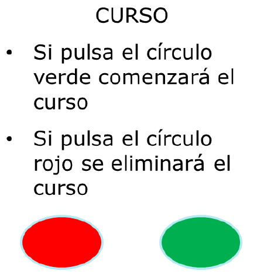
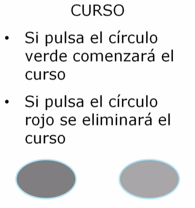
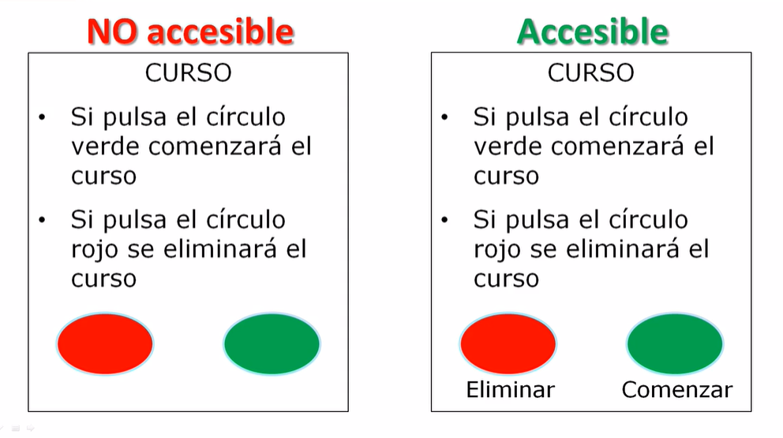
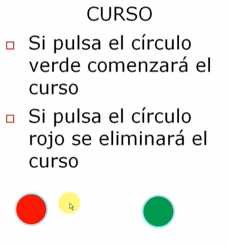
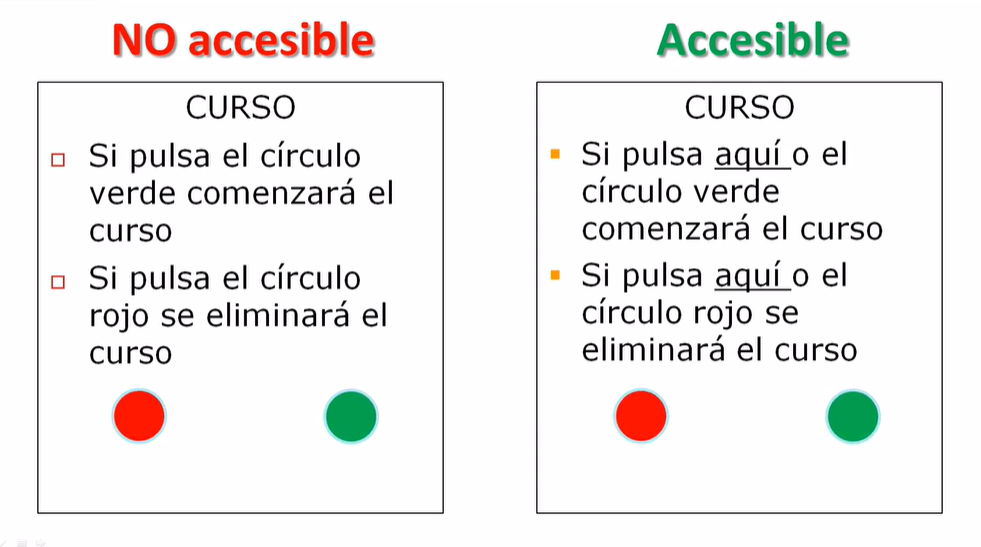
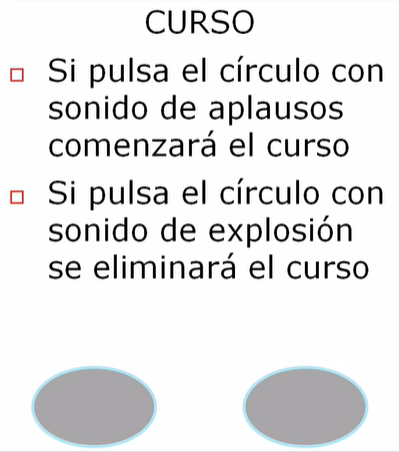
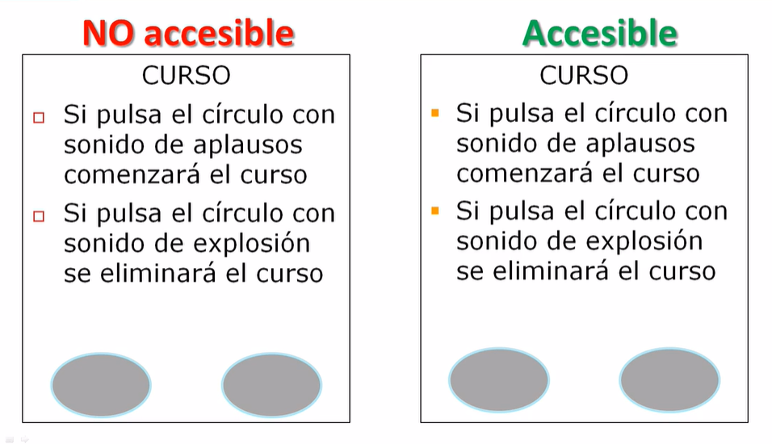
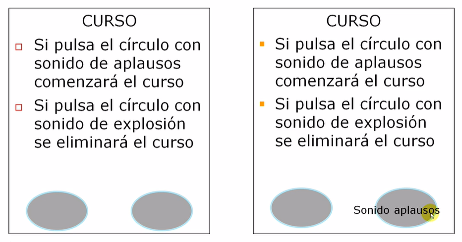

# 02. Ejemplos de problemas de accesibilidad

Esta lección pertenece al curso [“Aprende Accesibilidad Web Paso a Paso”](http://accesibilidadweb.es/).

## Presentación

Hola, soy [Sergio Luján Mora](https://sergiolujanmora.es/), profesor de informática de la Universidad de Alicante (España). En este vídeo vamos a ver tres ejemplos de barreras de accesibilidad que podemos encontrar en las páginas web.

## Autor de los ejemplos

El autor de estos ejemplos es mi amigo y compañero José Ramón Hilera González, profesor de la Universidad de Alcalá, que me ha cedido el uso de estos ejemplos.

Los ejemplos que vamos a analizar afectan principalmente a los usuarios con discapacidad visual, con discapacidad motora y con discapacidad auditiva, aunque también podrían afectar a otros grupos de usuarios con discapacidad.

## Usuarios con discapacidad visual

En primer lugar, el ejemplo con usuarios con discapacidad visual, como puede ser una persona ciega, una persona con baja visión o una persona con ceguera al color o daltonismo.

En este ejemplo se nos indica:

- Si pulsa el círculo verde comenzará el curso.
- Si pulsa el círculo rojo se eliminará el curso.

Una persona que no pueda ver no puede percibir los colores, así que no sabrá que botón tiene que pulsar. Pero lo mismo le puede pasar a una persona con ceguera al color, también llamado daltonismo.

Los síntomas varían de una persona a otra, pero normalmente una persona con ceguera al color tiene dificultad para ver los colores y su brillo en la forma usual y también tiene problemas para establecer la diferencia entre sombras del mismo color o de colores similares.

![Manzanas verde y rojo(_images/02_manzanas-verde-rojo.png)

Por tanto, una persona con daltonismo puede ser que vea los dos colores de esta forma y tendrá problemas para elegir el botón adecuado.

Pero esto mismo nos puede pasar a todos nosotros cuando, por ejemplo, accedemos a una página web a través de un teléfono móvil a plena luz del día en un día con mucha luminosidad.

¿Cómo se puede eliminar esta barrera?

A la izquierda está la solución no accesible y a la derecha la solución accesible. La barrera de accesibilidad que existía se ha eliminado al añadir una alternativa textual a los botones.

## Usuarios con discapacidad motora

Ahora vamos a ver el ejemplo con usuarios con discapacidad motora, como puede ser una persona con paraplejia que no puede mover sus extremidades o una persona con la enfermedad de parkinson que tiene dificultad para controlar sus movimientos.

En este ejemplo se nos indica:

- Si pulsa el círculo verde comenzará el curso.
- Si pulsa el círculo rojo se eliminará el curso.

En este ejemplo el usuario tiene que perseguir al botón con el cursor del ratón para poder pulsarlo. Puede parecer un ejemplo exagerado, pero a veces ocurren este tipo de situaciones en las páginas web.

Una persona con discapacidad motora puede tener un tiempo de respuesta lento y quizás no sea capaz de pulsar el círculo. Pero esto mismo nos puede pasar a todos nosotros cuando, por ejemplo, nos rompemos un brazo y no podemos usar el ratón con la mano que normalmente empleamos para utilizar el ratón.

¿Cómo se puede resolver este problema?

Se tiene que ofrecer una alternativa, se tiene que complementar una forma de interactuar con otra.

El usuario que no sea capaz de seguir los círculos podrá pulsar sobre estos enlaces estáticos que no se mueven. Además, deberíamos asegurar que los enlaces también son accesibles a través del teclado con la tecla tabulador.

## Usuarios con discapacidad auditiva

Y ya para terminar, un ejemplo similar pero esta vez con usuarios con discapacidad auditiva, como puede ser una persona sorda o con baja audición.

En este ejemplo se nos indica:

- Si pulsa el círculo con sonido de aplausos comenzará el curso.
- Si pulsa el círculo con sonido de explosión se eliminará el curso.

Al pasar el ratón por encima de cada círculo se escucha el sonido de una explosión o de unos aplausos.

Evidentemente, una persona con discapacidad auditiva que no pueda escuchar los sonidos no sabrá que botón tiene que pulsar. Pero lo mismo le puede pasar a una persona que esté en una biblioteca en la que se tiene que guardar silencio o una persona que esté utilizando un ordenador que no disponga de sonido.

**¿Cómo se puede resolver este problema?**

A la izquierda tenemos el ejemplo no accesible y a la derecha la solución accesible. Aparentemente parecen iguales, pero cuando se sitúa el cursor del ratón sobre uno de los círculos, además de reproducirse el sonido también se muestra un texto.

De este modo, aunque no se puedan escuchar los sonidos, un usuario puede decidir qué botón desea pulsar.

## ¿Qué es lo más importante de estos tres ejemplos?

Los ejemplos que hemos visto no sólo afectan a las personas con discapacidad, pueden afectar a todo el mundo porque se pueden generar barreras de accesibilidad producidas por el contexto de uso. Por tanto, la accesibilidad web no sólo beneficia a las personas con discapacidad, nos beneficia a todos.

## Solución

Y la solución se basa en dos principios.

- En las páginas web deben ofrecer alternativas, diferentes presentaciones que se adapten a las necesidades de diferentes usuarios
- Se deben crear páginas que se transformen correctamente, páginas web que se puedan visualizar correctamente con diferentes dispositivos, diferentes colores, diferentes tamaños de letra.
